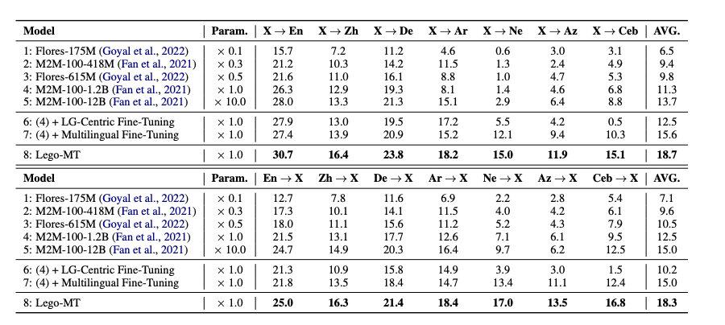
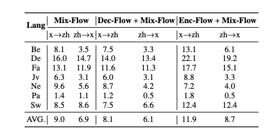
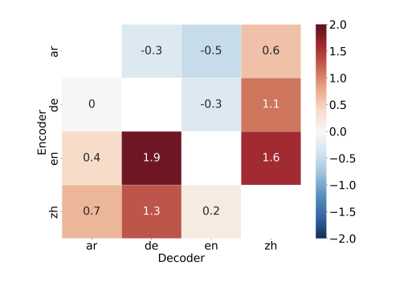

​	

<!-- more -->

Paper：<https://arxiv.org/pdf/2212.10551.pdf>

Github: <https://github.com/CONE-MT/Lego-MT>

## Introduction

The paper "Lego-MT: Learning Detachable Models for Massively Multilingual Machine Translation" proposes a new approach to training models for machine translation across many languages. The existing multilingual machine translation models encounter mainly two challenges, parameter interference and inefficient inference from large models. To address these issues, the following key ideas are proposed :

- Using a multi-branch architecture where each language or group of languages has its own encoder and decoder modules. This avoids interference between parameters for different languages. 

- A novel training recipe involving language-centric data grouping and triple training flows (Mix-Flow, Enc-Flow, Dec-Flow) which allows efficient training by only loading certain modules into GPU memory at a time.

- Introducing a "unified space" concept for mapping representations of different languages into a common space to enable transfer learning. 

This work constructs a new massive multilingual dataset covering 433 languages and 1.3 billion parallel sentences, greatly extending the scale compared to prior work. The detachable and modular nature of the model named Lego-MT allows flexible combination of different modules at inference time. Experiments demonstrate significant gains of 3.2 spBLEU over strong baselines like M2M-100 of similar parameter size, with particular benefits for low-resource languages. The training recipe also provides major speedups over conventional multi-branch training.

Overall, this introduces an efficient and effective approach to scaling up multilingual neural machine translation to hundreds of languages. The innovations in model architecture, training procedure, and dataset creation help address key challenges in the domain of massively multilingual machine translation.

Next, we will introduce and analyze Lego-MT from three aspects: 1) the challenges of massively multilingual machine translation; 2) the motivation and methods of Lego-MT; 3) the performance and analysis of Lego-MT.

## Challenges in massively multilingual machine translation models
The goal of creating a single machine translation model capable of handling hundreds of languages is incredibly appealing. However, simply scaling up existing methods faces major obstacles. 

Cramming all languages into a single model inevitably causes parameter interference, as the limited capacity must be shared across languages. This ends up disproportionately hurting lower resource languages, as the model prioritizes fitting the high resource languages well. The intertwined parameters also make it hard to add customized capacity for each language.

Moreover, even if a translation only requires a small subset of the full model, current architectures inefficiently load all parameters during inference. This slows down computation and wastes resources.

Attempted fixes like adapter modules[1] or mixture-of-experts([2],[3],[4]) provide partial solutions, but come with their own limitations. Adapters add some language-specific capacity through new tunable parameters, but don't fully isolate languages. MoE allows selective parameter activation, but still must load the full model. 

Meanwhile, conventional pretraining techniques meant for other NLP tasks often have objectives mismatched from final translation tasks. This makes it hard to transfer their benefits to multilingual translation models.

These challenges create a pressing need for more suitable model architectures and training techniques. To truly scale multilingual translation to massive scales covering hundreds of diverse languages, we need ways to mitigate parameter interference, enable customized tuning, and improve inference efficiency. Meeting this need is the motivation behind innovations like the modular Lego-MT model.

The above figure intrdouces the monolithic model and the multi-way architecture. Monolithic model is a fully-shared model for all translation directions. The multi-way structure is introduced in this paper, Lego-MT, which includes both multilingual and language specific encoder and decoder like English(denoted as E), Chinese(denoted as C) etc, to avoid interference among the parameters of different languages. The architecture is detachable at inference time where only a specific encoder and decoder are needed, thereby improving the efficiency of inference. U (Unified space) represents hidden representations generated by encoders, where representations of different languages are mappped to a common space to enable transfer learning.

## Motivation and Techniques of LegoMT
When multilingual models are jointly trained for both high resource and low resource languages together, they will prioritise the high-resource languages due to the avilability of extremely large amounts of high quality data. Moreover, the parameters of these different languages interfere with one another leading to a lower performance for all the languages. Another major issue with the monolithic multilingual models is having to load all the model parameters during inference even while translating between only a subset of languages.

Motivated by the above issues, and inspired by the classic multi-way architectures, this paper introduces a novel detachable model called Lego-MT, where each language has their own encoder and decoder modules.

The key insights to the methodology used in this paper are as follows:
 - Data Grouping: The multilingual training data is divided into language-centric groups, so each group contains data related to one core language (e.g. English, Chinese), such that only those specific branches need to be loaded into GPU memory
 - Language-Specific Branches: Separate encoder and decoder modules are created for each core language. Additionally, one multilingual encoder and decoder module is added to facilitate cross-lingual learning. This modular design mitigates interference across languages.
 - Sequential Training: The language-centric groups are trained sequentially. For each group, only the data and modules related to that language are loaded into GPU memory. This eliminates wasteful computation and speeds up training.
 - Triple Training Flows: As shown in the diagram below, within each language-centric training phase, three flows are used -
   - Mix-Flow: Trains Multilingual encoder and Multilingual decoder on all the data
   - Enc-Flow: Trains Language-specific encoder on data of that language
   - Dec-Flow: Trains Language-specific decoder on data of that language
 - Two-Stage Training: Enc-Flow and Mix-Flow are trained jointly in stage 1. Dec-Flow is trained separately in stage 2 after initializing with stage 1 model. This two-stage approach prevents catastrophic forgetting in the multilingual encoder.
 - Unified Representations: The triple training flows facilitates the model to map inputs and outputs to a shared representation space across languages. This results in a unified multilingual model.

At the inference stage, multilingual encoder/language-specific encoder of the source language is used for encoding. Similarly, for decoding, the multilingual decoder/language-specific decoder of the target language is used to infer from the Lego-MT model, as shown in the figure below.

The experiments on Flores-101 translation benchmark show Lego-MT outperforms strong baselines. It achieves an average gain of 3.2 BLEU over M2M-100-1.2B baseline and even surpasses M2M-100-12B on many-to-one translation. The proposed training method brings a 28.2X speedup over conventional multi-way training. 

Overall, the paper demonstrates an effective and efficient approach to scale up multilingual NMT while mitigating key issues faced by monolithic models.

## Baselines and Evaluation

LegoMT is trained using the OPUS parallel corpus(https://opus.nlpl.eu/), the authors use 7 core languages (En, Zh, De, Ar, Ne, Az, Ceb) and 433 other languages. 

For evaluation the authors use Flores-101 [5] human-written translation set on languages that align with M2M-100 [6] model. The paper evaluates all baselines and Lego-MT on this exhaustive set of 85 x 7 directions. 

You can find the baselines in the table below. Flores-175M is baselines released with Flores-101 dataset and M2M-100 baselines are different variants of Transformer released by [6]

## Results

Some key findings that we can infer from the evaluatio are as follows:

1. **Lego-MT achieves better performance overall as well as language wise**: Lego-MT uses 0.1x parameters compared to M2M-100-12B and still achieves better performance especially in the many-to-one setting (5.0 spBLEU). Lego-MT performs better than both M2M-100-1.2B and M2M-100-1.2B+Multilingual Fine-tuning which is trained with the same data corroborating the effectiveness of detachable and efficient training.

2. **Low-resource translation benefits more from multi-way models**: X→ Ne, X→Az and X→Ceb have significantly better improvements than X→En, X→Zh and X→De. This aligns with previous findings on how interference denigrates performance in low-resource settings and how detached modules can avoid that.

3. **Role of the multilingual branch:**: The high value of difference between LegoMT and  M2M-100-1.2B trained with language-centric data shows how language-centric training is prone to overfitting and how the multilingual branch is essential to avoid overfitting and catastrophic forgetting of transfer from other closer languages.

Further, LegoMT is also more Efficient than the baselines 

1. **Efficient Training:** Each encoder and decoder branch in LegoMT is initialized with 418M M2M-100 model, each instance only requires loading the language pair specific encoder and decoder. While M2M-100-1.2B has 1.2B parameters and hence cannot load as much tokens as LegoMT in a single forward step. The authors show that empirically they observed that LegoMT was 28.2x faster
   
2. **Reasonable Training cost:** Even though Lego-MT uses 8 encoders and 8 decoders, for each instance, the first stage only updates LG encoder and multilingual encoder-decoder and the second stage updates LG decoder. So effectively the cost is only about 2 times of the cost of normal multilingual fine-tuning in case of M2M-1.2B

## Ablations and Analysis

#### Flow of training

As mentioned earlier, there are 3 flows of training - Enc Flow, Dec Flow and Mix Flow. The paper performs ablation for X → Zh and Zh→ X, where X contains 7 languages split across high and low-resource category. We notice in the figure below that the performance drop in BLEU when jointly training Dec-Flow and Mix-Flow is quite high. This can be attributed to the fact that Dec-Flow training can vastly change the distribution of the multilingual decoder - making it essential to precede Dec-Flow with Mix-Flow. Further jointly training Enc-Flow and Mix-Flow has the most improvement

  

#### Selecting the right Inference Path

During inference, there are 3 possible paths of inference M-encoder + M-decoder, E-encoder + M-decoder, M-encoder + D-decoder. The below image shows that low-resource settings prefer M-Flow from LG to X, as it allows them to learn from similar languages instead of low-resource E-flow. For LG in Zh, En and De, we see they prefer Dec-Flow for X → LG owing to less interference in decoder side.

  

#### Learning alignment between different branches

To ensure the Unified space is consistent, the paper performed experiments for translation within the 4 languages (Zh, En, De and Ar). For this we compare the difference between 1. Mix-Flow and  2. LG specific Encoder and LG specific decoder (the model has not been trained on this). The below plot shows the difference 2-1, indicating that even without specific training of the flow 2, it performs better than Mix-Flow in 9/12 cases.

  

### Other Interesting Findings
- Achieves promising results on Unseen languages: For low-resource source or target languages, or for particular src-target translation pair missing in the training data, Lego-MT shows better performance than M2M-100-12B.
- Faster Convergence, Performance Independent of Initialization: Even with random initialization, Lego-MT achieves convergence and high performance unlike the normal multilingual finetuning
- Comparison with ChatGPT: LegoMT surpasses ChatGPT in En → X direction. For X→ En direction, ChatGPT has lower performance but does slightly better than LegoMT with 8-shot inference

## Summary
LegoMT presents an efficient detachable training recipe in the space of multilingual machine translation with a single model. In the process, the authors curate a MNMT dataset covering 433 languages. Results on Flores-101 indicate how LegoMT surpasses performance over strong baselines like M2M-100-1.2B

## References
[1]Zhu, Yaoming, et al. "Counter-interference adapter for multilingual machine translation." In Findings of the Association for Computational Linguistics: EMNLP (2021)

[2]Jacobs, Robert, et al. Adaptive mixtures of local experts. Neural computation, 3(1):79–87.

[3]Costa-jussà, Marta, et al. No language left behind: Scaling human-centered machine translation.(2022) CoRR, abs/2207.04672.

[4]Du, Nan, et al. Efficient scaling of language models with mixture-of-experts. In International Conference on Machine Learning, pages 5547–5569. PMLR

[5] Naman Goyal, Cynthia Gao, Vishrav Chaudhary, Peng-Jen Chen, Guillaume Wenzek, Da Ju, Sanjana Krishnan, Marc'Aurelio Ranzato, Francisco Guzmán, Angela Fan: The FLORES-101 Evaluation Benchmark for Low-Resource and Multilingual Machine Translation. CoRR abs/2106.03193 (2021)

[6] Angela Fan, Shruti Bhosale, Holger Schwenk, Zhiyi Ma, Ahmed El-Kishky, Siddharth Goyal, Mandeep Baines, Onur Celebi, Guillaume Wenzek, Vishrav Chaudhary, et al. 2021. Beyond english-centric multilingual machine translation. J. Mach. Learn. Res., 22(107):1–48.
