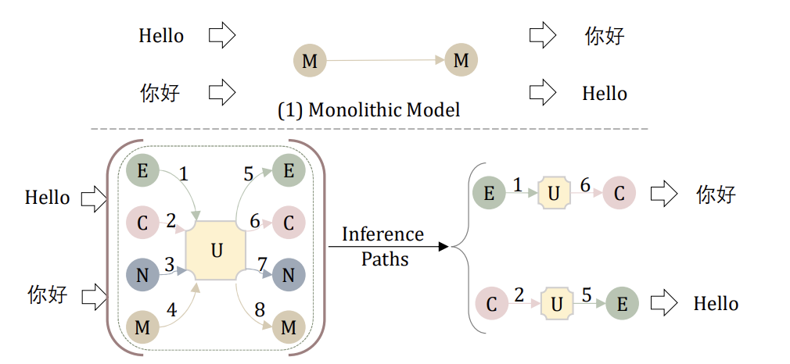
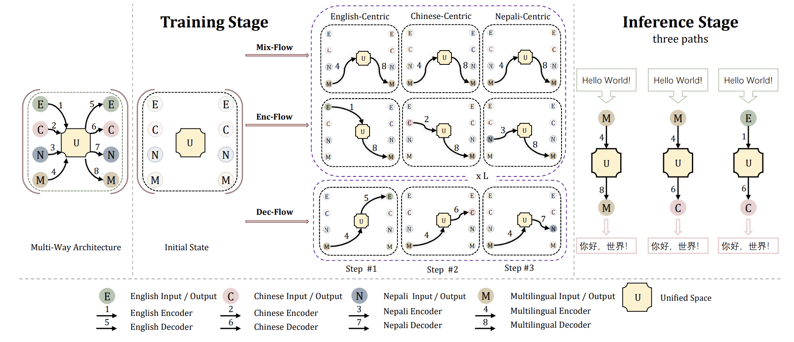

​	

<!-- more -->

Paper：<https://arxiv.org/pdf/2212.10551.pdf>

Github: <https://github.com/CONE-MT/Lego-MT>

## Introduction

The paper "Lego-MT: Learning Detachable Models for Massively Multilingual Machine Translation" proposes a new approach to training models for machine translation across many languages. The existing multilingual machine translation models encounter mainly two challenges, parameter interference and inefficient inference from large models. To address these issues, the following key ideas are proposed :

- Using a multi-branch architecture where each language or group of languages has its own encoder and decoder modules. This avoids interference between parameters for different languages. 

- A novel training recipe involving language-centric data grouping and triple training flows (Mix-Flow, Enc-Flow, Dec-Flow) which allows efficient training by only loading certain modules into GPU memory at a time.

- Introducing a "unified space" concept for mapping representations of different languages into a common space to enable transfer learning. 

This work constructs a new massive multilingual dataset covering 433 languages and 1.3 billion parallel sentences, greatly extending the scale compared to prior work. The detachable and modular nature of the model named Lego-MT allows flexible combination of different modules at inference time. Experiments demonstrate significant gains of 3.2 spBLEU over strong baselines like M2M-100 of similar parameter size, with particular benefits for low-resource languages. The training recipe also provides major speedups over conventional multi-branch training.

Overall, this introduces an efficient and effective approach to scaling up multilingual neural machine translation to hundreds of languages. The innovations in model architecture, training procedure, and dataset creation help address key challenges in the domain of massively multilingual machine translation.

Next, we will introduce and analyze Lego-MT from three aspects: 1) the challenges of massively multilingual machine translation; 2) the motivation and methods of Lego-MT; 3) the performance and analysis of Lego-MT.

## Challenges in massively multilingual machine translation models
The goal of creating a single machine translation model capable of handling hundreds of languages is incredibly appealing. However, simply scaling up existing methods faces major obstacles. 

Cramming all languages into a single model inevitably causes parameter interference, as the limited capacity must be shared across languages. This ends up disproportionately hurting lower resource languages, as the model prioritizes fitting the high resource languages well. The intertwined parameters also make it hard to add customized capacity for each language.

Moreover, even if a translation only requires a small subset of the full model, current architectures inefficiently load all parameters during inference. This slows down computation and wastes resources.

Attempted fixes like adapter modules[1] or mixture-of-experts([2],[3],[4]) provide partial solutions, but come with their own limitations. Adapters add some language-specific capacity through new tunable parameters, but don't fully isolate languages. MoE allows selective parameter activation, but still must load the full model. 

Meanwhile, conventional pretraining techniques meant for other NLP tasks often have objectives mismatched from final translation tasks. This makes it hard to transfer their benefits to multilingual translation models.

These challenges create a pressing need for more suitable model architectures and training techniques. To truly scale multilingual translation to massive scales covering hundreds of diverse languages, we need ways to mitigate parameter interference, enable customized tuning, and improve inference efficiency. Meeting this need is the motivation behind innovations like the modular Lego-MT model.

The above figure intrdouces the monolithic model and the multi-way architecture. Monolithic model is a fully-shared model for all translation directions. The multi-way structure is introduced in this paper, Lego-MT, which includes both multilingual and language specific encoder and decoder like English(denoted as E), Chinese(denoted as C) etc, to avoid interference among the parameters of different languages. The architecture is detachable at inference time where only a specific encoder and decoder are needed, thereby improving the efficiency of inference. U (Unified space) represents hidden representations generated by encoders, where representations of different languages are mappped to a common space to enable transfer learning.

## Motivation and Techniques of mRASP
When multilingual models are jointly trained for both high resource and low resource languages together, they will prioritise the high-resource languages due to the avilability of extremely large amounts of high quality data. Moreover, the parameters of these different languages interfere with one another leading to a lower performance for all the languages. Another major issue with the monolithic multilingual models is having to load all the model parameters during inference even while translating between only a subset of languages.

Motivated by the above issues, and inspired by the classic multi-way architectures, this paper introduces a novel detachable model called Lego-MT, where each language has their own encoder and decoder modules.

The key insights to the methodology used in this paper are as follows:
 - Data Grouping: The multilingual training data is divided into language-centric groups, so each group contains data related to one core language (e.g. English, Chinese), such that only those specific branches need to be loaded into GPU memory
 - Language-Specific Branches: Separate encoder and decoder modules are created for each core language. Additionally, one multilingual encoder and decoder module is added to facilitate cross-lingual learning. This modular design mitigates interference across languages.
 - Sequential Training: The language-centric groups are trained sequentially. For each group, only the data and modules related to that language are loaded into GPU memory. This eliminates wasteful computation and speeds up training.
 - Triple Training Flows: Within each language-centric training phase, three flows are used -
  - Mix-Flow: Trains Multilingual encoder and Multilingual decoder on all the data
  - Enc-Flow: Trains Language-specific encoder on data of that language
  - Dec-Flow: Trains Language-specific decoder on data of that language
 - Two-Stage Training: Enc-Flow and Mix-Flow are trained jointly in stage 1. Dec-Flow is trained separately in stage 2 after initializing with stage 1 model. This two-stage approach prevents catastrophic forgetting in the multilingual encoder.
 - Unified Representations: The triple training flows facilitates the model to map inputs and outputs to a shared representation space across languages. This results in a unified multilingual model.

The experiments on Flores-101 translation benchmark show Lego-MT outperforms strong baselines. It achieves an average gain of 3.2 BLEU over M2M-100-1.2B baseline and even surpasses M2M-100-12B on many-to-one translation. The proposed training method brings a 28X speedup over conventional multi-way training. 

Overall, the paper demonstrates an effective and efficient approach to scale up multilingual NMT while mitigating key issues faced by monolithic models.

## Effectiveness of mRASP
mRASP uses parallel corpus of 32 languages to-and-from English for pre-training. When we only use parallel corpus of English to French wmt14 for fine-tuning, it achieves 44.3 BLEU without laborious Back Translation of massive monolingual corpus. Moreover, when applied to a new translation direction Dutch (Nl) to Portuguese (Pt), with only 12,000 parallel sentence pairs for fine-tuning, mRASP gets a reasonable (BLEU 10 +) model in ten minutes. By contrast, training any usable MT model from scratch using the equivalent parallel sentence pairs is impossible (BLEU is close to 0).

In summary, mRASP has the following advantages:
1. Easy to reproduce

The pre-training of mRASP only requires a total of 110 million parallel sentence pairs (the same pair of parallel sentence is applicable to both directions, resulting in a total of 220 million training samples), and the vocabulary only has 64k bpe subword tokens. Compared with other pre-training methods, in which tens of billions of data and dozens of layers are frequently used, the training process is less difficult. We can complete the pre-training process on 32 languages in less than a week using 8 GPUs. By the way, support for more languages can also be simply expanded.

2. Highly Versatile

Compared with the single-directional machine translation models, mRASP brings a consistent improvement in rich, medium and low-resource scenarios. Even for English to French direction where we have the largest parallel corpus, the translation quality is further improved by 1.1 BLEU. More surprisingly, for Dutch to Portuguese direction that have never been seen in the pre-training data, a significant improvement of 10 + BLEU has also been achieved.

Here are some representative experimental results:

### 1. En-De and En-Fr Benchmarks
The following figure compares the effect of mRASP on En-De and En-Fr with several concurrent cross-lingual pre-training models. It can be seen that mRASP has certain advantages: it reaches 30.3 (tokenized BLEU) on En->De wmt 2016 test set, 44.3 (tokenized BLEU) on En->Fr wmt 2014 test set. CTNMT uses BERT pre-training. MASS introduces large-scale monolingual data. mBERT is a multilingual BERT model. mBART is another pre-training method that is proposed concurrently, it uses massive multilingual monolingual data, and is trained on 256 GPUs for 20 days.

### 2. Extend to language not seen during the pre-training phase
Directions that are not included in parallel pairs during the pre-training stage, are also referred as "Exotic Directions". Whether mRASP is effective on Exotic Directions, determines whether mRASP has good generalization capabilities.

The Exotic Directions are divided into four situations in the paper:

- Exotic Pair: Both the source language and the target language have been individually pre-trained, but the model has not yet seen the bilingual pairs of them
- Exotic Source: The model has only seen the target language in the pre-training stage, and the source language has not been seen at all
- Exotic Target: The model has only seen the source language in the pre-training stage, and the target language has not been seen at all
- Exotic Full: The model has not seen the source language or the target language at all in the pre-training stage

It is difficult to train machine translation under the circumstances. Of course, the most difficult one is the last one, which is equivalent to requiring people who have never learned Latin and Hindi to read a few sentences in Latin and Hindi then translate between them.

|  Category  | Source language seen during pre-training? | Target language seen during pre-training? | Language pair seen during pre-training? | 
| :----------:| :---: | :----: | :----:|
|  Exotic Pair  | ✔ | ✔ |  X |
|  Exotic Source  |  X | ✔ | X |
| Exotic Target  | ✔ | X | X |
|  Exotic Full  | X | X |  X|

It is worth noting that both sides of Fr-Zh have appeared separately, but they have not appeared as parallel pairs. mRASP achieves a 20 + BLEU score after fine-tuning on 20K parallel corpus.

For Exotic Full scenario, such as Dutch to Portuguese (Nl-Pt), only 12,000 parallel corpora are used, and after about 10 minutes of training, you can achieve a 10+ BLEU score.

### 3. Case study
In order to understand the effect of mRASP more intuitively, the authors also make a case study in the paper.

#### French-Chinese(Fr-Zh)

- Exotic Pair, 20k Parallel Sentence Pair
- Direct (0.7 BLEU) is much weaker than mRASP (25.8 BLEU)

The Direct system does not work at all, while the mRASP system translates well.

| | Original Text | Translation in English |
| :---: | :--- | :--- |
|  source | Ordre du jour provisoire de la 7424e séance ( privée ) du Conseil | Provisional agenda for the 7424th (closed) meeting of the Council |
| target | 安全 理事会 第 7424 次 ( 闭门 ) 会议 临时 议程 | Security Council, 7424th (closed) meeting, provisional, agenda |
| Direct | 事实上 ， 国际 货币 基金 组织 的 国际 货币 基金 组织 （ IMF ） | In fact, international, monetary, fund, organization, international, monetary, fund, organization (IMF) |
| mRASP | 安理会 第 7424 次 （ 非 公开 ） 会议 临时 议程 | Council, 7424th (closed) meeting, provisional, agenda |

#### Dutch-Portuguese (Nl-Pt)
- Exotic Full, 12,000 parallel sentence pairs
- Direct 0 BLEU vs mRASP 14.1 BLEU

We find that the translation system obtained by mRASP can not successfully translate every detail, but it can grasp the key information of the original text. For example, in the following example (1) date (2) minutes of the meeting <-> news of meeting (3) circulated <-> shared.

| | Original Text | Translation in English |
| :---: | :--- | :--- |
| source | de notulen van de vergadering van donderdag 21 september zijn rondgedeeld. | The minutes of the meeting on Thursday, 21 September have been circulated. |
| target | a acta da sessão de quinta feira , 21 de setembro de 2000 , já foi distribuída. | The minutes of the meeting on Thursday, 21 September 2000 have now been distributed. |
| Direct | Os governos, os líderes mundiais dos seus próprios. | Governments, their own world leaders. |
| mRASP | As notícias da reunião do dia 21 de Setembro foram partilhadas. | News of the September 21 meeting has been shared. |

#### English-French (En-Fr)

- We found that one of the advantages of the model trained by the mRASP method over the Direct method is that the Direct system tends to ignore meaningless words (such as articles, deixis, etc.), while the mRASP maintains the consistency of articles and deixis.

| | Text |
| :---: | :--- |
| source | An investigation is under way to find the cause of the fire . |
| target | Une enquête est en cours pour trouver la cause de cet incendie . |
| Direct | enquête est en cours pour déterminer la cause de l' incendie . |
| mRASP | Une enquête est en cours pour trouver la cause de l' incendie . |

| | Text |
| :---: | :--- |
| source | After Broadway and London , Paris is finally finding its voice . |
| target | Après Broadway et Londres , Paris trouve enfin sa voix . |
| Direct | Broadway et Londres , Paris trouve enfin sa voix . |
| mRASP | Après Broadway et Londres , Paris trouve enfin sa voix . |

#### English-Chinese (En-Zh)
| | Original Text | Translation in English |
| :---: | :--- | :--- |
| source | and for the middle class. | |
| target | 对中产阶级而言。 | For the middle class. |
| Direct | 还有中产阶级。  | And the middle class. |
| mRASP | 对中产阶级而言。  | For the middle class. |

### Findings from mRASP trained model

As a general pre-training model, where does the improvements of mRASP for downstream MT tasks come from?

The author believes that its improvements mainly comes from two aspects:
 
  1. mRASP narrows the gap between the vector representation of synonyms across different languages
  2. mRASP narrows the gap between the vector representation of synonymous sentences across different languages

The narrowing of the gap between word-level and sentence-level representations means that after learning parallel sentence pairs in a large number of languages in the pre-training stage, mRASP implicitly "mastered" the language-independent representation, which can be migrated to any language, so mRASP can generally improve the effect of downstream machine translation tasks.

#### 1. mRASP draws word-level vector representation of different language closer
RAS is introduced by making the same context shared between synonyms across different languages. Since the word vector is determined by the context, RAS further draws the representation of synonyms across different languages closer.

Up: w/o RAS, Down: w/ RAS

It can be seen that with the RAS method, the embedding distribution between different languages is drawn closer (the angle becomes smaller).

#### 2. mRASP draws sentence-level vector representation of different language closer
mRASP narrows the gap between the representation of synonyms, as well as the vector representation of semantics.

We use the encoder output vector as the representation of the sentence (L2 normalized averaged-pooled encoded output). From the TED parallel test set (filtered 15-way parallel test set, a total of 2284), we match the nearest sentence based on similarity score (cosine similarity), then calculate the Top-1 accuracy (sentence retrieval accuracy).

Figure 1: The accuracy of mRASP minus the accuracy of mBART [9]. Note that Dutch (Nl) has never appeared in the mRASP pre-training data, and the accuracy in other directions is much higher than that of mBART.

- The average accuracy of mRASP retrieval reached 76%

Figure 2: Accuracy of mRASP minus the accuracy of mRASP w/o RAS. It can be seen that RAS  has obvious benefits on languages (Nl) that did not appear in the pre-training stage.

Figure 3: After removing the language identifier (Language token) at the beginning of the sentence, the accuracy of Nl can be further improved, at a sacrifice that the accuracy of other languages is greatly reduced.

It can be seen that RAS does further draws closer the semantic vector representation, and synonymous sentences will be closely represented after mRASP.

## Summary
Back to the beginning of the article, Mr. Chao, a language genius, has mastered 33 dialects plus 7 foreign languages in his life. From Baoding in the north China to Fuzhou in the south, from the upper reaches to the lower reaches of the Yangtze River, from Berkeley in the United States to Paris in France, he can speak local languages with a local accent. And the establishment of a unified multilingual and cross-domain translation model is one of the ultimate goals of machine translation research. mRASP, which is in line with the language genius Yuen Ren Chao, has established a successful path from multilingual pre-training to fine-tuning to multiple machine translation models, which will also become a new paradigm of machine translation. ByteDance has applied this technology to the Volctrans system and you can try it in the web page attached at the end of the text. We are looking forward to the continuous emergence of new methods in this direction, making great strides towards the ultimate machine translation goal. In the next few years, the progress of machine translation can help everyone in dozens of countries become "Yuen Ren Chao" and truly communicate without language barriers.

## References
[1]Zhu, Yaoming, et al. "Counter-interference adapter for multilingual machine translation." In Findings of the Association for Computational Linguistics: EMNLP (2021)

[2]Jacobs, Robert, et al. Adaptive mixtures of local experts. Neural computation, 3(1):79–87.

[3]Costa-jussà, Marta, et al. No language left behind: Scaling human-centered machine translation.(2022) CoRR, abs/2207.04672.

[4]Du, Nan, et al. Efficient scaling of language models with mixture-of-experts. In International Conference on Machine Learning, pages 5547–5569. PMLR

[1] Lin, Zehui, et al. "Pre-training Multilingual Neural Machine Translation by Leveraging Alignment Information." In the Conference on Empirical Methods in Natural Language Processing  (2020).

[2] Devlin, Jacob, et al. "Bert: Pre-training of deep bidirectional transformers for language understanding." NAACL-HLT (1) 2019: 4171-4186.

[3] Thomas, Reed, and Callie Mady. "Teaching for transfer: Insights from theory and practices in primary-level French-second-language classrooms." McGill Journal of Education/Revue des sciences de l'éducation de McGill 49.2 (2014): 399-416.

[4] Johnson, Melvin, et al. "Google’s multilingual neural machine translation system: Enabling zero-shot translation." Transactions of the Association for Computational Linguistics 5 (2017): 339-351.

[5] Radford, Alec, et al. "Improving language understanding by generative pre-training." (2018): 12.

[6] Vaswani, Ashish, et al. "Attention is all you need." Advances in neural information processing systems. 2017.

[7] Song, Kaitao, et al. "MASS: Masked Sequence to Sequence Pre-training for Language Generation." ICML. 2019.

[8] Lewis, Mike, et al. "Bart: Denoising sequence-to-sequence pre-training for natural language generation, translation, and comprehension."  ACL 2020: 7871-7880

[9] Liu, Yinhan, et al. "Multilingual denoising pre-training for neural machine translation." TACL.2020

[10] Yang, et al. "Towards Making the Most of BERT in Neural Machine Translation"  AAAI.2020
